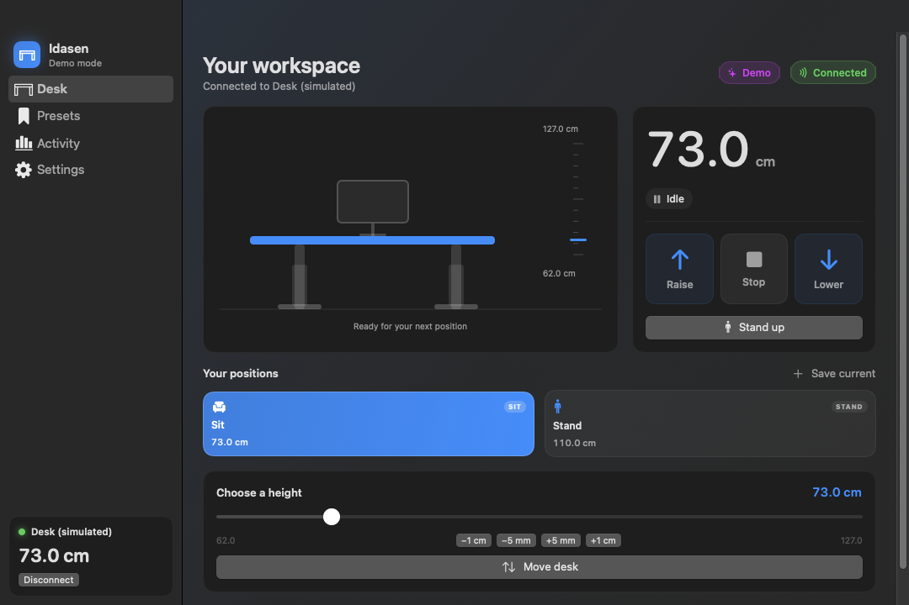

# Idasen for macOS — IKEA IDÅSEN standing desk controller

[Website](https://zcuric.github.io/idasen-macos/) · [Releases](https://github.com/zcuric/idasen-macos/releases) · [Report an issue](https://github.com/zcuric/idasen-macos/issues) · [Support development](https://buymeacoffee.com/zcuricy)


A native macOS app for IKEA IDÅSEN standing desks. Other LINAK controllers may share the protocol, but compatibility is unverified.
Connect over Bluetooth, move the desk to exact heights, save presets, keep an
eye on time at sitting and standing heights — and drive everything from the menu bar or
global keyboard shortcuts.

```
make app      # build build/Idasen.app
make run      # build and launch it
make test     # run the unit tests
swift run Idasen --demo   # explore the UI without a desk
```

Requires macOS 14+. Build with Xcode 27 / Swift 6.4; all targets use Swift 6 language mode and checked concurrency. Native glass controls are available on macOS 26 and later.

[](https://zcuric.github.io/idasen-macos/)

*Development capture in demo mode. The current app also includes a grouped sidebar and Today summaries.*

Independent software; not affiliated with IKEA or LINAK.

## Install and build

```sh
git clone https://github.com/zcuric/idasen-macos.git
cd idasen-macos
make test
make app
open build/Idasen.app
```

`make package` creates an architecture-labelled ZIP and SHA-256 checksum in `build/`.
Builds are ad-hoc signed, not Developer ID signed or notarized. Check each release's
architecture and signing notes before downloading. macOS may ask you to approve
opening a downloaded app in **System Settings → Privacy & Security**.

## Features

**Desk control**

- Connect over Bluetooth LE with one click; the app remembers your desk and
  reconnects automatically (with backoff) when the connection drops.
- Live height readout in centimetres or inches, with movement direction and
  speed.
- Press-and-hold Raise / Lower, a prominent Stop, and fine nudges (±0.5 cm,
  ±1 cm, configurable step).
- Keyboard: hold `↑`/`↓` to move, `space` or `esc` to stop, `⌘.` from the menu,
  and system-wide `⌃⌥↑` / `⌃⌥↓` / `⌃⌥S` (hold-to-move included).
- Move to an exact height with the target slider, or to any saved preset.
- Live movement speed and destination beside the height readout.
- Animated side-view illustration that follows the real height, shows the
  ruler position and a ghost marker for the in-flight target.

**Presets**

- Capture the current height as a preset, rename, re-icon, reorder by dragging,
  and mark one preset as *Sit* and one as *Stand*.
- Right-click any preset for quick actions; `⇧⌘T` toggles between sit and stand.

**Menu bar**

- Optional menu bar extra showing a desk icon beside the live height (or just the icon).
- Today’s sitting/standing totals and standing-goal progress in both the dashboard and menu.
- Raise / lower / stop, one-click presets, connect / disconnect, open the app.

**Activity tracking**

- Sit/stand timeline for today, standing goal with progress ring, transitions
  and longest standing streak.
- 14-day standing chart, today's height chart, 30-day history, CSV export.
- Adjustable sit/stand threshold, standing goal and history retention.

**Reminders & notifications**

- Opt-in standing reminders with adjustable intervals, a sitting-only option,
  and *Stand up now* / *Snooze 10 min* notification actions.
- Reminder intervals restart on opt-in, reconnect, or a new sitting session. Alerts
  wait until movement stops. Enabling reminders requests notification permission.
- Optional notifications when the desk reaches a target or when the connection
  changes, plus arrival sounds.

**Global shortcuts**

- Carbon-based, so they work over any app and need no Accessibility or Input
  Monitoring permission: hold to raise/lower, press to stop, and one shortcut
  per preset. All recorded in Settings.

**Other**

- Launch at login (`SMAppService`), light/dark/system appearance, six accent
  colours, demo mode with a simulated desk, height calibration for desks whose
  controller reports shifted values, a diagnostics log, and safety watchdogs
  (stall detection, collision detection, hard timeout, stop on sleep/logout).

---

## Using it with a real desk

1. Launch Idasen and click **Find desk** (the pairing sheet opens on first run).
2. Press any button on the desk to wake its controller — an IDÅSEN controller
   sleeps when idle and only advertises for a while after being touched.
3. Pick the device called **Desk** in the list. macOS asks for Bluetooth
   permission the first time; the app never needs pairing in System Settings.

Notes and troubleshooting:

- The desk accepts a single connection at a time. Quit the IKEA app (or your
  phone) if it is holding the connection.
- If heights look shifted by a constant amount, use
  **Settings › Desk › Calibrate…** and enter the height you measure with a tape.
- The busier `99fa0002` command channel is used for holding raise/lower; exact
  moves use the reference-input channel (`99fa0031`) at 10 Hz, which the desk
  treats as an absolute target. The wake-up + stop preflight that arms that
  channel is sent before starting an automatic move. Retargeting an active
  position move in the same direction preserves movement without a stop/restart.
- Controllers that ignore the reference input are detected within ~1.2 s and
  the app falls back to raise/lower commands with a braking-distance
  controller, so preset moves still work (within a few millimetres).
- Demo mode simulates a desk so you can explore all of the above without
  hardware.

Activity is estimated from desk height while connected, not occupancy. Settings, presets, and history are stored locally.

## Bluetooth protocol

The app speaks the LINAK/IDÅSEN protocol directly (UUID base
`338a-1024-8a49-009c0215f78a`):

| UUID (`99fa…`) | Direction | Purpose |
| --- | --- | --- |
| `0001` | advertise | Service advertised by the desk (used to spot it) |
| `0002` | write | Movement commands: `47 00` up, `46 00` down, `FF 00` stop, `FE 00` wake |
| `0003` | notify | Controller movement state |
| `0021` | notify/read | `[height: uint16 LE][speed: int16 LE]`, units of 0.1 mm, relative to a 62 cm datum |
| `0031` | write | Reference input: target `uint16 LE` in the same units, re-sent every 100 ms; `01 80` aborts |

Decoding follows the widely used `idasen`/`idasen-ha` implementations: the
height characteristic reports `height_mm = 620 + raw / 10`, so a desk at 73.05 cm
reports `1105`.

## Project layout

```
Sources/IdasenKit/     protocol, BLE transport, controller, activity store (testable, no UI)
Sources/IdasenApp/     SwiftUI app: views, theme, menu bar, hot keys, notifications
Tests/IdasenKitTests/  unit tests for codecs, controller state machine, stores
Scripts/               app bundle assembly and app icon generation
```

`IdasenKit` is deliberately UI-free: the protocol codec, the movement state
machine (`DeskService`), the settings/preset stores and the activity recorder
can all be tested without hardware. `DeskLink` is the transport seam — the real
`BluetoothDeskLink` and the `SimulatedDeskLink` used by demo mode are
interchangeable.

## Development

```
swift build                     # build everything
swift test                      # unit tests
swift run Idasen --demo      # run from source in demo mode
./Scripts/build-app.sh          # assemble and ad-hoc sign build/Idasen.app
./Scripts/make-icon.sh          # regenerate Resources/AppIcon.icns
```

Developer flags (used by the UI review workflow in this repo):

| Flag | Effect |
| --- | --- |
| `--demo` | Force demo mode for this launch |
| `--debug-log` | Mirror the in-app diagnostics log to stderr |
| `--dev-snapshot <path>` | Render a simulated desk with isolated temporary settings/history; never connects to hardware |
| `--dev-repeat` | Snapshot every 2 s (`path-1.png`, `path-2.png`, …) |
| `--dev-tab desk\|presets\|activity\|settings` | Select a sidebar tab for the snapshot |
| `--dev-theme light\|dark\|system` | Appearance for an isolated snapshot |
| `--dev-size 940x640` | Preview window size (minimum 940 × 640) |
| `--dev-moving` | Start a simulated move before the snapshot |
| `--dev-quit` | Flush preview data and exit after snapshotting |
| `--dev-activity-fixture` | Write 21 days of synthetic activity, then exit |

## Safety

Movement commands are always bounded: the desk's own controller stops if it
receives no command for about a second, automatic moves are re-checked against
a stall detector, a wrong-direction check for the collision feature and a hard
timeout (`Settings › Desk › Safety timeout`, default 45 s). Any quit, sleep or
user switch sends an explicit stop first.

## UI and motion implementation notes

- Native navigation and button styles follow the system appearance, including
  macOS 27. Content surfaces stay opaque; custom hold/stop controls and preset tiles use
  interactive `glassEffect` surfaces in shared `GlassEffectContainer` groups.
  Standard actions use native `.glass` / `.glassProminent` button styles.
  The Move/Cancel group has stable glass identities and materialize transitions;
  reduced motion suppresses the layout animation. macOS 14–25 use material fallbacks.
  See Apple's [macOS 27 design updates](https://developer.apple.com/videos/play/wwdc2026/289/)
  and [Liquid Glass adoption guidance](https://developer.apple.com/documentation/technologyoverviews/adopting-liquid-glass).
- Activity recording retains every supplied sample's timing but publishes at most
  once per second. Routine JSON encoding/writes run on a serial utility queue;
  explicit saves and shutdown flush that queue. Charts observe activity directly.
- BLE writes respect CoreBluetooth flow control. Pending motion is coalesced,
  expires after 500 ms, and is discarded on Stop. Stop packets do not expire.
  Writes requiring a response are serialized; no app queue can recall packets
  already handed to CoreBluetooth.
- Position moves begin on the first 100 ms controller tick (previously the second).
  Arrival waits for the controller's stopped signal. Same-direction retargets
  send a new position immediately, without another wake/stop sequence.
- The desk's reported speed has an undocumented unit. Displayed speed is estimated
  from calibrated height samples; closely spaced duplicate packets no longer
  falsely reset that estimate to zero.

### Hardware limits and verification

There is no verified command in the implemented protocol for choosing motor
speed, acceleration, or the release deceleration curve. The
[reverse-engineered protocol](https://github.com/jechtom/linak-desk-client/blob/master/protocol.md)
exposes directional movement and absolute targets. The user's hardware logs
showed peaks near 5 cm/s before this pass. This update reduces app-created waits
and interruptions; it does **not** establish a higher physical top speed.
Manual release and Stop still request an immediate stop. Softer physical release
requires a verified controller capability and measurement on the actual desk.

Controller regressions use simulated or injected telemetry. The simulator does
not model motor inertia, payload, collision behavior, or Bluetooth radio latency;
passing those tests is not a measurement of mechanical smoothness. Visual review uses isolated demo snapshots for layout and the native window
compositor for Liquid Glass. AppKit bitmap caching can omit glass layers or
produce black regions, so `--dev-snapshot` alone cannot validate glass appearance. No autonomous real-desk movements are
performed during these checks.

## Automation and website

- **Build and test macOS app** runs `swift test`, builds the app using the Xcode 27
  runner, and uploads an Apple silicon ZIP and checksum as workflow artifacts.
- **Deploy website** publishes the static site to GitHub Pages on `main` changes.
- `make site` assembles `build/site` from `docs/` and the root `tokens.css`.
  Preview with `python3 -m http.server 8080 --directory build/site`.
- Website fonts and images are self-hosted. No analytics or runtime JavaScript
  is needed. Canonical URL, Open Graph/X metadata, SoftwareApplication data,
  semantic headings, and a sitemap support search discovery.
- Submit `https://zcuric.github.io/idasen-macos/sitemap.xml` in Search Console
  after verifying ownership. A project-level `robots.txt` would not control
  crawling of the `zcuric.github.io` host, so none is added here.

See [the X launch draft](PROMOTION.md). Search rankings and rich results are not guaranteed.

## Support development

[Buy Zdravko a coffee](https://buymeacoffee.com/zcuricy).

<a href="https://buymeacoffee.com/zcuricy"></a>

Website fonts are distributed under their included SIL Open Font Licenses in
`docs/assets/`. No software license has been selected for the app yet.
